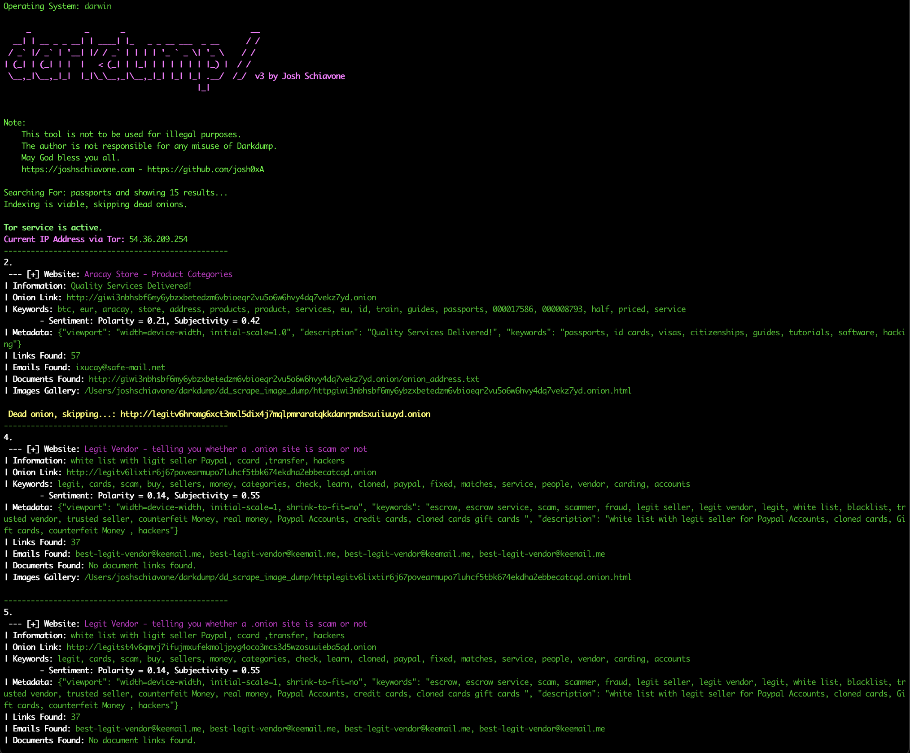

# darkdump

## About 
Darkdump is a OSINT interface for carrying out deep web investgations written in python in which it allows users to enter a search query in which darkdump provides the ability to scrape .onion sites relating to that query to try to extract emails, metadata, keywords, images, social media etc. Darkdump retrieves sites via Ahmia.fi and scrapes those .onion addresses when connected via the tor network. 

## Installation
1) ``git clone https://github.com/josh0xA/darkdump``<br/>
2) ``cd darkdump``<br/>
3) ``python3 -m pip install -r requirements.txt``<br/>
   • Make sure `PySocks` is installed (it is now listed in `requirements.txt`).  
4) ``python3 darkdump.py --help``<br/>

### Tor Configuration 
To use Darkdump effectively, you need to configure Tor to allow your script to control it via the Tor control port. Here's how to set up your `torrc` file and verify that Tor is running: <br/>

#### Step 1: Install Tor
If Tor is not already installed on your system, you need to install it. Here's how you can install Tor on various operating systems:

Debian/Kali/Ubuntu: `sudo apt install tor`<br/>
MacOS: `brew install tor`<br/>

#### Step 2: Configure the Tor torrc File<br/>
Locate your torrc file. This file is usually found at `/etc/tor/torrc`on Linux and sometimes Mac. 

Add the following lines to your torrc to enable the control port and set a control port password:
```
ControlPort 9051
HashedControlPassword [YourHashedPasswordHere]
```
Replace `[YourHashedPasswordHere]` with a hashed password which can be generated using the `tor --hash-password` command: `tor --hash-password "my_password"`

#### Step 3: Start Tor Service
Linux: `sudo systemctl start tor.service`<br/>
MacOS: `brew services start tor`<br/>

> **Port note:**  
> • **Tor Browser** exposes a SOCKS5 proxy on **`localhost:9150`** (this is the default that Darkdump now uses).  
> • The system Tor daemon typically listens on **`localhost:9050`**.  
> • If you are running the daemon on 9050 instead of Tor Browser, either edit `Configuration.__socks5init__` in `darkdump.py` or start Tor Browser so the 9150 proxy is available.  

Darkdump will test the connection automatically and print an error if the proxy cannot be reached.

### Example Queries: 
`python3 darkdump.py -q "hacking" -a 10 --scrape --proxy` - search for 10 links and scrape each site <br/>
`python3 darkdump.py -q "free movies" -a 25` - don't scrape, just return 25 links for that query (does not require tor) <br/>
`python3 darkdump.py -q "marketplaces" -a 15 --scrape --proxy -i` - search for 10 links and scrape each site as well as find and store images.
`python3 darkdump.py -q "cryptography" -a 5 --scrape --proxy -b firefox` – scrape 5 results while forcing a Firefox-specific User-Agent.  

## Menu
```

     _            _       _                            __
  __| | __ _ _ __| | ____| |_   _ _ __ ___  _ __      / /
 / _` |/ _` | '__| |/ / _` | | | | '_ ` _ \| '_ \    / / 
| (_| | (_| | |  |   < (_| | |_| | | | | | | |_) |  / /  
 \__,_|\__,_|_|  |_|\_\__,_|\__,_|_| |_| |_| .__/  /_/  v3 by Josh Schiavone 
                                           |_|           

usage: darkdump.py [-h] [-v] [-q QUERY] [-a AMOUNT] [-p] [-i] [-s]

Darkdump is an interface for scraping the deepweb through Ahmia. Made by yours truly.

options:
  -h, --help            show this help message and exit
  -v, --version         returns darkdump's version
  -q QUERY, --query QUERY
                        the keyword or string you want to search on the deepweb
  -a AMOUNT, --amount AMOUNT
                        the amount of results you want to retrieve
  -p, --proxy           use tor proxy for scraping
  -i, --images          scrape images and visual content from the site
  -s, --scrape          scrape the actual site for content and look for keywords
  -b {chrome,firefox,ie,edge,opera,safari,mobile}, --browser {chrome,firefox,ie,edge,opera,safari,mobile}
                        specify the browser family to use when randomly
                        choosing a User-Agent header (default is a completely
                        random choice)

```

## Enhanced User-Agent Handling  🚀
Darkdump ships with an overhauled **`headers/agents.py`** module that now:

* Organises more than 200 User-Agent strings by browser family (Chrome, Firefox, IE / Edge, Opera, Safari, Mobile).  
* Provides convenience helpers:
  * `Headers.get_random_agent()` – any UA  
  * `Headers.get_random_by_browser('chrome')` – browser-specific UA  
  * `Headers.get_random_by_os('windows')` – OS-specific UA  
  * `Headers.get_modern_agent()` – modern (2022+) UA  
* Fixes malformed strings and removes duplicates.

Use the new **`-b / --browser`** CLI switch (see Menu above) to restrict the UA that Darkdump advertises during requests.

For a hands-on tour of the new API, run the helper script:

```bash
python test_headers.py
```

It prints examples for every helper method and shows category counts.

## Visual
<p align="center">
  
</p>

## Ethical Notice
The developer of this program, Josh Schiavone, is not resposible for misuse of this data gathering tool. Do not use darkdump to navigate websites that take part in any activity that is identified as illegal under the laws and regulations of your government. May God bless you all. 

## License 
MIT License<br/>
Copyright (c) Josh Schiavone
